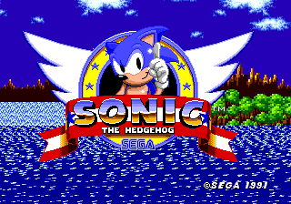

# Sega Mega Drive / Genesis Emulator (Java)

An educational **Sega Mega Drive** (Genesis) emulator written from scratch in
**Java 21**, a sibling to the NES emulator in `../nes-emulator-java`. It implements
a Motorola **68000** CPU core, a subset of the **VDP** (video display processor),
cartridge loading with real header parsing, the controller protocol, and a
resizable Swing display.

> **You must supply your own ROM.** No game ROM is included or distributed with
> this project. Only use ROM images of games you legally own.

---

## ⚠️ Status: boots real games to their title screens

The Mega Drive is a much larger machine than the NES — a 16/32-bit 68000, a Z80
co-processor, a complex VDP, and FM + PSG sound. A *complete* emulator that plays
*Sonic* all the way through is a multi-month effort. This project is an honest,
well-tested **foundation** — but it now boots a real commercial ROM. *Sonic The
Hedgehog* (USA/Europe) runs through its boot sequence, the SEGA logo, and into
the animated title screen:



Background planes **and sprites** render (Sonic appears on his title emblem).
What it does **not** yet do: play sound, or run full gameplay that depends on the
features listed below. Here is exactly what works and what does not:

### ✅ Implemented
- **Cartridge loading** — plain `.bin`/`.md`/`.gen` images and interleaved
  `.smd` (de-interleaved automatically), with full 256-byte header decoding
  (title, region, checksum, I/O support, ROM size).
- **Motorola 68000 core** — broad instruction coverage (MOVE/MOVEA/MOVEQ/MOVEP,
  MOVEM, LINK/UNLK, LEA/PEA, the ALU groups ADD/SUB/AND/OR/EOR/CMP with their
  immediate and extended forms ADDX/SUBX/ABCD/SBCD/NBCD/CMPM, NOT/NEG/CLR/TST/
  SWAP/EXT, the shift/rotate group, the bit group, MUL/DIV, CHK,
  Bcc/BRA/BSR/DBcc/Scc, JMP/JSR/RTS/RTE/RTR, TRAP/TRAPV/STOP, status-register
  ops) with all 14 addressing modes, line-A/F traps and exception vectors.
- **Memory bus** — the real Mega Drive 68000 memory map (cartridge, 64 KB work
  RAM, Z80 area, I/O, VDP ports).
- **VDP** — control/data port protocol, all 24 registers, VRAM/CRAM/VSRAM, the
  status register and HV counter, the vertical **and horizontal** interrupts,
  DMA (68000→VRAM/CRAM/VSRAM, VRAM fill, VRAM copy), scrolling
  (per-line/per-cell H-scroll, whole-screen **or per-column V-scroll**),
  the **window plane**, **shadow/highlight** mode, **H40/H32** width switching,
  and a **layered renderer**: scroll planes A and B plus the **sprite layer**
  (linked-list traversal, 1–4 cell sizes, H/V flip, palettes, per-pixel priority
  resolution, sprite overflow/collision flags, basic X=0 masking).
- **Controller** — the 3-button pad's TH-multiplexed read protocol.
- **YM2612** — register/status ports (status reads as not-busy so the busy-wait
  loops games run after the SEGA logo terminate). Audio synthesis is still a stub.
- **Swing UI** — 320×224 display with aspect-correct scaling, ROM-info dialog,
  reset/pause, keyboard input. Plus a **headless mode** (`--headless`/`--info`)
  backed by the `debug.Debugger` harness.
- **Tests** — a JUnit suite covering the CPU, the bus, the VDP (ports + sprites),
  ROM parsing, and the debug harness, including regression tests for the bugs
  found while booting Sonic (SWAP/PEA decode, MOVE-to-SR, Z80 bus-request,
  YM2612 status).

### 🚧 Not yet implemented (the roadmap — see `PLAN.md`)
- **The Z80 core** (stubbed: only the bus-request/reset handshake is modelled).
- **Sound**: the YM2612 FM chip and SN76489 PSG accept register writes but
  produce silence.
- **VDP interlace** modes and **sub-line timing** (the H-interrupt itself is
  implemented; the HV counter's horizontal position and exact HBLANK timing are
  still per-scanline). Shadow/highlight is an approximation.
- **Save RAM (SRAM)** and bank-switching mappers; the 6-button pad; PAL/50 Hz.

In short: it **boots commercial ROMs and renders their title screens with
sprites** (Sonic appears on his title emblem). Sound and the remaining VDP/timing
features are what stand between this and full gameplay; `PLAN.md` is the
phase-by-phase roadmap there.

---

## Requirements

- **JDK 21 or newer** (`java -version` should report 21+).
- Optionally **Gradle 8.x** if you prefer the Gradle workflow.

## Running

### Option A — no build tool (simplest)

```bash
./run.sh path/to/your-game.md         # macOS / Linux
run.bat  path\to\your-game.md         # Windows
```

The script compiles the sources into `out/` and launches the emulator. You can
also start it with no argument and load a ROM from the **File → Open ROM…** menu.

### Option B — Gradle

```bash
gradle run                            # opens the window
gradle run --args="path/to/game.md"   # boots straight into a ROM
gradle test                           # run the JUnit test suite
gradle build                          # compile + test + assemble
```

### Headless mode (development / debugging)

The emulator can run without a window — useful for quick checks and capturing
screenshots during development:

```bash
./run.sh --info game.md                          # print the decoded ROM header
./run.sh --headless --frames 600 game.md         # run 600 frames, print stats
./run.sh --headless --frames 360 --shot out.png game.md   # …and save a screenshot
```

This is backed by `com.segaemu.debug.Debugger`, the harness used to diagnose
boot issues (frame stepping, PC breakpoints, RAM inspection, frame hashing).

## Controls

| Action  | Key         |
|---------|-------------|
| D-pad   | Arrow keys  |
| A       | A           |
| B       | S           |
| C       | D           |
| Start   | Enter       |

Load a ROM, and use **Emulation → Reset** or **Pause / Resume** as needed.
**Help → ROM Info** shows the decoded cartridge header.

---

## How it compares to the NES emulator

| Concept        | NES (`NesSystem`)        | Mega Drive (`GenesisSystem`)       |
|----------------|--------------------------|------------------------------------|
| CPU            | Ricoh 2A03 (6502)        | Motorola 68000                     |
| Co-processor   | —                        | Zilog Z80 (sound)                  |
| Video          | 2C02 PPU                 | VDP (315-5313)                     |
| Sound          | APU (5 channels)         | YM2612 FM + SN76489 PSG            |
| Bus interface  | `Bus` (8-bit)            | `Bus68000` (8/16/32-bit, BE)       |
| ROM format     | iNES (`.nes`)            | BIN/SMD (`.md`/`.bin`/`.gen`/`.smd`) |

The architecture deliberately mirrors the NES project so the two are easy to read
side by side.
